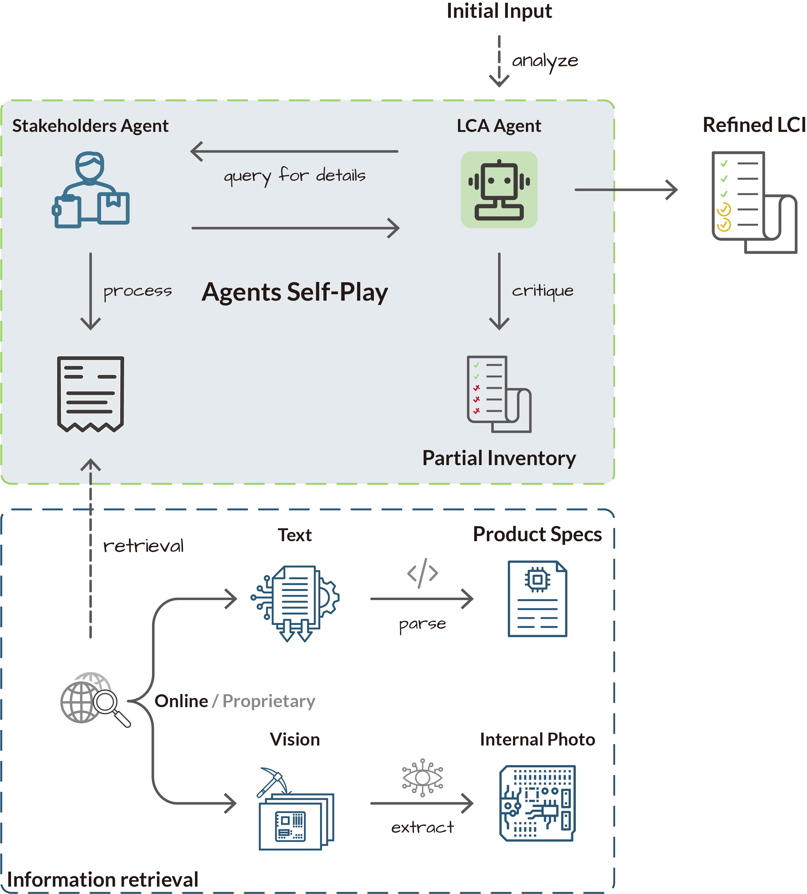

# Agentic LCI Construction

Multimodal agentic pipeline to design and fill a Life Cycle Inventory (LCI) of a product given just its name or a photo.

## Overview

The system is organized around two interacting agents and a unified tool layer:

- **LCA Agent**
    - Interprets the user query
    - Designs a domain-specific Life Cycle Inventory (LCI) schema
    - Analyzes, critiques, and revises the inventory as evidence accumulates
- **Stakeholder Agent**
    - Retrieves and parses evidence via MCP tools
    - Extracts data from web search, technical reports, and images
    - Fills the inventory incrementally with cited sources
- **MCP Server**
    - Unified tool interface for:
        - Web search
        - PDF and report parsing
        - Image and diagram interpretation
    - Designed to be extensible and LLM agnostic

## Architecture



### High-level flow:

1. User query → LCA Agent
2. LCA Agent proposes an inventory schema
3. Stakeholder Agent retrieves and parses evidence
4. Inventory is iteratively filled, critiqued, and revised

The architecture is intentionally modular so that:
* new domains can define their own LCI schemas (we include a general purpose one and an electronics focused one) and how to assess environmental impact from those schemas,
* new retrieval tools can be added without touching agent logic (we include general web search, vendor-specific report parsers, and a custom computer-vision pipeline for internal product photos),
* UI layers can be attached independently (we demonstrate a context-aware, interactive browser extension [here](https://github.com/iamZhihanZhang/Living-Sustainability)).

## Quickstart

```bash
pip install -e .
lca-self-play --query "iPhone 15 Pro 128GB"
```

This runs a full self-play episode between the LCA and Stakeholder agents using the default MCP toolset and produces an LCI.

## Setup
Install [Python 3.10+](https://www.python.org/downloads/release/python-3100/), then run:
```bash
. ./scripts/setup_system.sh # system deps (e.g., tesseract)
. ./scripts/setup_python.sh # venv + pip install -e .
. ./scripts/setup_models.sh # SAM + YOLO weights
```

Next, create your environment file:
```bash
cp .env.example .env
```
Populate the following keys as needed:
- **Google Search API** (web+image retrieval): [instructions](https://programmablesearchengine.google.com/controlpanel/all)
- **OpenAI API** (LCA + Stakeholder agents): [instructions](https://openai.com/index/openai-api/)
- **Roboflow API** (YOLO-based PCB segmentation) [instructions](https://docs.roboflow.com/developer/authentication/find-your-roboflow-api-key)
- **Electricity Maps API** (calculating usage-phase carbon intensity): [instructions](https://app.electricitymaps.com/auth/signup)

You can now run the workflow with
```bash
lca-self-play --query "14 inch Macbook Pro M4 Max with 36GB ram"
```
- Use the `--llm-provider` option with any of the providers in `lca-agentic/llm_adapters` to select the provider used for the agents (`openai` is default)
- Use the `--llm-model` option with a model id supported by the selected provider to select the model used for the agents (`gpt5` is default)
- Use the `--image` option followed by an image url/path to input an image of your product (this can be in addition to or instead of the text input)
- Use the `--max-rounds` option followed by a positive integer for the maximum number of information retrieval rounds

Also feel free to add other relevant information to your query such as the location to use for the usage phase calculation, etc.

## Citation

If you use this code, please cite the accompanying paper.
